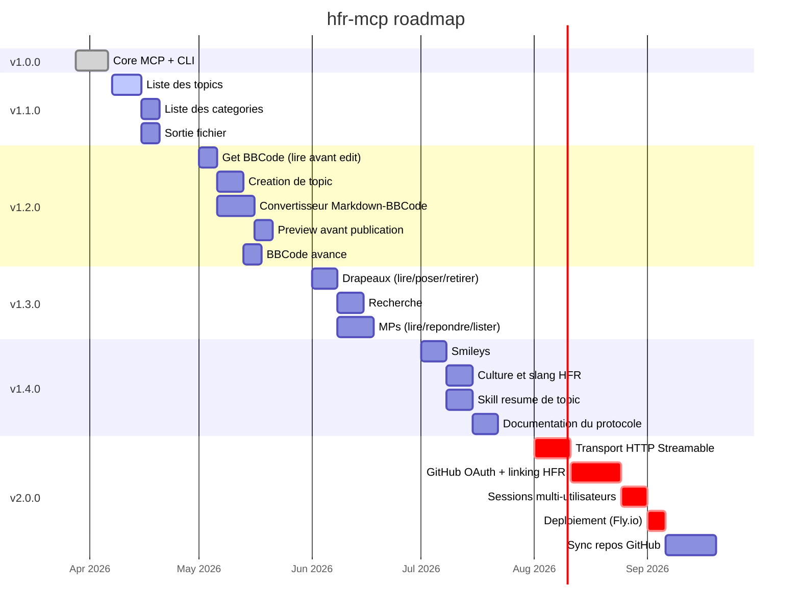

# hfr-mcp

Outils Go pour [forum.hardware.fr](https://forum.hardware.fr) : un serveur [MCP](https://modelcontextprotocol.io/) pour Claude et une CLI standalone.

Lire des topics, poster des reponses, editer des messages, citer, envoyer des MPs — depuis Claude Code, Claude Desktop ou le terminal.

## Fonctionnalites

| Action | MCP tool | CLI |
|--------|----------|-----|
| Lire un topic | `hfr_read` | `hfr read <cat> <post> [page]` |
| Lire en mode print | `hfr_read` (print=true) | `hfr print <cat> <post> [page]` |
| Lister les topics d'une categorie | `hfr_topics` | `hfr topics <cat> [subcat]` |
| Poster une reponse | `hfr_reply` | `hfr reply <cat> <post> <content>` |
| Editer un post | `hfr_edit` | `hfr edit <cat> <post> <numreponse> <content>` |
| Citer un message | `hfr_quote` | `hfr quote <cat> <post> <numreponse>` |
| Multiquote | `hfr_quote` (numreponses) | `hfr quote <cat> <post> <n1> <n2> ...` |
| Envoyer un MP | `hfr_mp` | `hfr mp <dest> <subject> <content>` |
| Version | — | `hfr version` / `hfr-mcp --version` |

Le contenu utilise le BBCode HFR (`[b]`, `[url=]`, `[quotemsg=...]`, smileys `:o`, `[:pseudo]`, etc.).

## Demarrage rapide

```bash
# Installation
go install github.com/XaaT/hfr-mcp/cmd/hfr-mcp@latest   # serveur MCP
go install github.com/XaaT/hfr-mcp/cmd/hfr@latest        # CLI

# Ou depuis les sources
go build -o hfr-mcp ./cmd/hfr-mcp/
go build -o hfr ./cmd/hfr/
```

### Configuration MCP (Claude Code)

Ajouter dans `.mcp.json` a la racine du projet, ou globalement via `claude mcp add --scope user` :

```json
{
  "mcpServers": {
    "hfr": {
      "command": "/chemin/vers/hfr-mcp",
      "env": {
        "HFR_LOGIN": "pseudo",
        "HFR_PASSWD": "motdepasse"
      }
    }
  }
}
```

Le login est lazy : la connexion a HFR ne se fait qu'au premier appel d'outil. La session persiste en memoire (cookie jar) pour toute la duree du process.

### Authentification

Fichier de configuration (premier trouve) :

1. `./hfr.conf` (repertoire courant)
2. `~/.config/hfr/config`

```
login=pseudo
passwd=motdepasse
```

Les variables d'environnement `HFR_LOGIN` / `HFR_PASSWD` prennent le dessus sur le fichier. Les permissions du fichier sont verifiees au demarrage : un warning s'affiche s'il est lisible par d'autres utilisateurs.

## Utilisation CLI

```bash
# Lecture anonyme
hfr read 13 120036 350

# Derniere page
hfr read 13 120036 last

# Range de pages (concurrent)
hfr read 13 120036 340:350

# Dernieres pages relatives (les 5 dernieres)
hfr read 13 120036 last-4:last

# Mode print (~1000 posts/page, sans signatures, ~4x plus leger)
hfr print 13 120036
hfr print 13 120036 --last 20

# Lister les topics d'une categorie
hfr topics 13
hfr topics 13 431

# Lecture authentifiee
hfr --auth read 13 120036 350

# Poster une reponse (auth automatique)
hfr reply 13 120036 "Hello HFR :o"

# Citer (retourne le BBCode [quotemsg=...])
hfr quote 13 120036 74497677

# Multiquote
hfr quote 13 120036 74497677 74497680 74497685

# Editer un post
hfr edit 13 120036 74497677 "contenu modifie"

# Envoyer un MP
hfr mp pseudo "Sujet" "Corps du message"
```

Les commandes d'ecriture (reply, edit, quote, mp) exigent l'authentification (automatique). `read`, `print` et `topics` fonctionnent en anonyme par defaut, `--auth` pour se connecter.

## Outils MCP

| Outil | Description |
|-------|-------------|
| `hfr_read` | Lire un topic. `page=0` pour la derniere page, `page_from`/`page_to` pour du batch concurrent, `print=true` pour le mode impression, `last=N` pour les N derniers posts |
| `hfr_topics` | Lister les topics d'une categorie/sous-categorie avec pagination |
| `hfr_reply` | Poster une reponse (BBCode) |
| `hfr_edit` | Editer un post existant (detecte le first post, preserve le sujet) |
| `hfr_quote` | Citer un ou plusieurs messages (`numreponse` ou `numreponses[]`) |
| `hfr_mp` | Envoyer un message prive |

## Optimisation tokens

- **Mode print** : `print=true` charge ~1000 posts/page au lieu de 40, sans signatures (~4x plus leger par post)
- **Nettoyage du contenu** : signatures, notices d'edition et compteurs de citation automatiquement supprimes
- **Batch concurrent** : les ranges de pages sont chargees en parallele (goroutines)
- **Pagination** : `TotalPages` retourne dans chaque reponse pour naviguer sans requetes supplementaires

## Roadmap



### v1.0.0 — Core MCP + CLI *(publiee)*

Serveur MCP et CLI fonctionnels : lecture, reponse, edition, citation, MP. Mode print, lecture batch concurrente, nettoyage du contenu, auth lazy.

### v1.1.0 — Navigation et efficacite

Explorer le forum et optimiser la sortie pour les grosses lectures.

- [#13](https://github.com/XaaT/hfr-mcp/issues/13) Liste des topics d'une categorie
- [#23](https://github.com/XaaT/hfr-mcp/issues/23) Liste des categories et sous-categories
- [#22](https://github.com/XaaT/hfr-mcp/issues/22) Sortie fichier (sauvegarder dans un fichier au lieu du contexte)

### v1.2.0 — Gestion de contenu

Edition intelligente, creation de topics, conversion Markdown/BBCode, gestion de First Posts.

- [#25](https://github.com/XaaT/hfr-mcp/issues/25) `hfr_get_bbcode`, `hfr_create_topic`, `hfr_convert`, `hfr_preview`
- [#16](https://github.com/XaaT/hfr-mcp/issues/16) BBCode avance et formatage de sortie

### v1.3.0 — Decouverte et communication

Recherche, drapeaux et MPs complets.

- [#14](https://github.com/XaaT/hfr-mcp/issues/14) Drapeaux (lire/poser/retirer les topics suivis)
- [#7](https://github.com/XaaT/hfr-mcp/issues/7) Recherche via `/search.php`
- [#15](https://github.com/XaaT/hfr-mcp/issues/15) MPs : lire la boite de reception, repondre dans les fils

### v1.4.0 — Culture et intelligence

Connaissance du forum et skills d'automatisation.

- [#5](https://github.com/XaaT/hfr-mcp/issues/5) Integration des smileys
- [#6](https://github.com/XaaT/hfr-mcp/issues/6) Culture et slang HFR
- [#18](https://github.com/XaaT/hfr-mcp/issues/18) Skill Claude Code de resume de topic
- [#10](https://github.com/XaaT/hfr-mcp/issues/10) Documentation complete du protocole HFR

### v2.0.0 — MCP distant

Accessible depuis Claude.ai web, Claude Code Web et tout client MCP distant.

- [#24](https://github.com/XaaT/hfr-mcp/issues/24) Transport HTTP Streamable, GitHub OAuth, multi-utilisateurs, deploiement Fly.io
- [#24](https://github.com/XaaT/hfr-mcp/issues/24) Sync bidirectionnelle repos GitHub (Markdown dans le repo, BBCode sur HFR)

## Architecture

```
cmd/hfr/main.go            CLI : sous-commandes, parsing args, --auth
cmd/hfr-mcp/main.go        Serveur MCP : lazy login, transport stdio
internal/hfr/client.go     Client HTTP, login, hash_check, cookie jar
internal/hfr/reader.go     Lecture de topics, mode print, batch concurrent
internal/hfr/parser.go     Parsing HTML (goquery), nettoyage du contenu
internal/hfr/post.go       Reply + Edit (detection first post)
internal/hfr/mp.go         Messages prives
internal/hfr/models.go     Post, Topic, TopicListItem, EditInfo
internal/hfr/errors.go     Types d'erreurs HFR
internal/hfr/version.go    Constante de version
internal/config/config.go  Fichier de config + env vars + verif permissions
internal/mcp/tools.go      Declaration des outils MCP
internal/mcp/helpers.go    Formatage des resultats
```

Deux binaires separes : le CLI (`hfr`) et le serveur MCP (`hfr-mcp`) ont des cycles de vie et des cibles de build independants.

## Dependances

- [go-sdk/mcp](https://github.com/modelcontextprotocol/go-sdk) — SDK MCP officiel
- [goquery](https://github.com/PuerkitoBio/goquery) — Parsing HTML

## Licence

MIT
