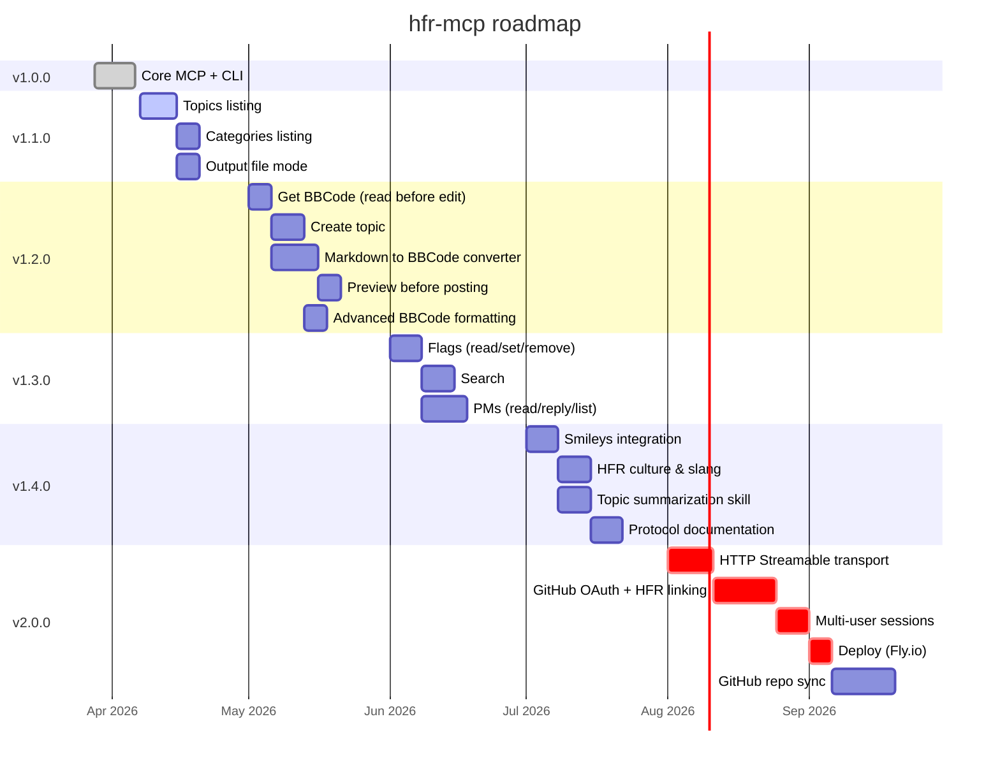

# hfr-mcp

Go toolset for [forum.hardware.fr](https://forum.hardware.fr): an [MCP](https://modelcontextprotocol.io/) server for Claude and a standalone CLI.

Read topics, post replies, edit messages, quote, send PMs — all from Claude Code, Claude Desktop, or the terminal.

## Features

| Action | MCP tool | CLI |
|--------|----------|-----|
| Read a topic | `hfr_read` | `hfr read <cat> <post> [page]` |
| Read in print mode | `hfr_read` (print=true) | `hfr print <cat> <post> [page]` |
| List topics in a category | `hfr_topics` | `hfr topics <cat> [subcat]` |
| Post a reply | `hfr_reply` | `hfr reply <cat> <post> <content>` |
| Edit a post | `hfr_edit` | `hfr edit <cat> <post> <numreponse> <content>` |
| Quote a message | `hfr_quote` | `hfr quote <cat> <post> <numreponse>` |
| Multiquote | `hfr_quote` (numreponses) | `hfr quote <cat> <post> <n1> <n2> ...` |
| Send a PM | `hfr_mp` | `hfr mp <dest> <subject> <content>` |
| Version | — | `hfr version` / `hfr-mcp --version` |

Content uses HFR BBCode (`[b]`, `[url=]`, `[quotemsg=...]`, smileys `:o`, `[:pseudo]`, etc.).

## Quick start

```bash
# Install
go install github.com/XaaT/hfr-mcp/cmd/hfr-mcp@latest   # MCP server
go install github.com/XaaT/hfr-mcp/cmd/hfr@latest        # CLI

# Or build from source
go build -o hfr-mcp ./cmd/hfr-mcp/
go build -o hfr ./cmd/hfr/
```

### MCP setup (Claude Code)

Add to `.mcp.json` at your project root, or globally via `claude mcp add --scope user`:

```json
{
  "mcpServers": {
    "hfr": {
      "command": "/path/to/hfr-mcp",
      "env": {
        "HFR_LOGIN": "pseudo",
        "HFR_PASSWD": "password"
      }
    }
  }
}
```

Login is lazy: the HFR connection only happens on the first tool call. The session persists in-memory (cookie jar) for the lifetime of the process.

### Authentication

Config file (first found):

1. `./hfr.conf` (current directory)
2. `~/.config/hfr/config`

```
login=pseudo
passwd=password
```

Environment variables `HFR_LOGIN` / `HFR_PASSWD` override the config file. File permissions are checked at startup — a warning is shown if readable by other users.

## CLI usage

```bash
# Anonymous read
hfr read 13 120036 350

# Last page
hfr read 13 120036 last

# Page range (concurrent)
hfr read 13 120036 340:350

# Relative last pages (last 5)
hfr read 13 120036 last-4:last

# Print mode (~1000 posts/page, no signatures, ~4x lighter)
hfr print 13 120036
hfr print 13 120036 --last 20

# List topics in a category
hfr topics 13
hfr topics 13 431

# Authenticated read
hfr --auth read 13 120036 350

# Post a reply (auto auth)
hfr reply 13 120036 "Hello HFR :o"

# Quote (returns BBCode [quotemsg=...])
hfr quote 13 120036 74497677

# Multiquote
hfr quote 13 120036 74497677 74497680 74497685

# Edit a post
hfr edit 13 120036 74497677 "updated content"

# Send a PM
hfr mp pseudo "Subject" "Message body"
```

Write commands (reply, edit, quote, mp) require authentication (automatic). `read`, `print` and `topics` work anonymously by default, use `--auth` to connect.

## MCP tools

| Tool | Description |
|------|-------------|
| `hfr_read` | Read a topic. `page=0` for last page, `page_from`/`page_to` for concurrent batch, `print=true` for print mode, `last=N` for last N posts |
| `hfr_topics` | List topics in a category/subcategory with pagination |
| `hfr_reply` | Post a reply (BBCode) |
| `hfr_edit` | Edit an existing post (detects first post, preserves subject) |
| `hfr_quote` | Quote one or more messages (`numreponse` or `numreponses[]`) |
| `hfr_mp` | Send a private message |

## Token optimization

- **Print mode**: `print=true` loads ~1000 posts/page instead of 40, without signatures (~4x lighter per post)
- **Content cleaning**: signatures, edit notices, and citation counters are automatically stripped
- **Concurrent batch**: page ranges are loaded in parallel (goroutines)
- **Pagination**: `TotalPages` returned in every response for navigation without extra requests

## Roadmap



### v1.0.0 — Core MCP + CLI *(released)*

Fully functional MCP server and CLI: read, reply, edit, quote, PM. Print mode, batch concurrent reads, content cleaning, lazy auth.

### v1.1.0 — Navigation & Efficiency

Browse the forum and optimize output for large reads.

- [#13](https://github.com/XaaT/hfr-mcp/issues/13) Topics listing
- [#23](https://github.com/XaaT/hfr-mcp/issues/23) Categories & subcategories listing
- [#22](https://github.com/XaaT/hfr-mcp/issues/22) Output file mode (save to file instead of context)

### v1.2.0 — Content Management

Intelligent editing, topic creation, Markdown/BBCode conversion, First Post management.

- [#25](https://github.com/XaaT/hfr-mcp/issues/25) `hfr_get_bbcode`, `hfr_create_topic`, `hfr_convert`, `hfr_preview`
- [#16](https://github.com/XaaT/hfr-mcp/issues/16) Advanced BBCode & output formatting

### v1.3.0 — Discovery & Communication

Search, bookmarks, and full PM support.

- [#14](https://github.com/XaaT/hfr-mcp/issues/14) Flags (read/set/remove followed topics)
- [#7](https://github.com/XaaT/hfr-mcp/issues/7) Search via `/search.php`
- [#15](https://github.com/XaaT/hfr-mcp/issues/15) PMs: read inbox, reply in threads

### v1.4.0 — Culture & Intelligence

Forum knowledge and automation skills.

- [#5](https://github.com/XaaT/hfr-mcp/issues/5) Smileys integration
- [#6](https://github.com/XaaT/hfr-mcp/issues/6) HFR culture & slang
- [#18](https://github.com/XaaT/hfr-mcp/issues/18) Topic summarization Claude Code skill
- [#10](https://github.com/XaaT/hfr-mcp/issues/10) Complete HFR protocol documentation

### v2.0.0 — Remote MCP

Accessible from Claude.ai web, Claude Code Web, and any remote MCP client.

- [#24](https://github.com/XaaT/hfr-mcp/issues/24) HTTP Streamable transport, GitHub OAuth, multi-user, deploy on Fly.io
- [#24](https://github.com/XaaT/hfr-mcp/issues/24) Bidirectional GitHub repo sync (Markdown in repo, BBCode on HFR)

## Architecture

```
cmd/hfr/main.go            CLI: subcommands, arg parsing, --auth
cmd/hfr-mcp/main.go        MCP server: lazy login, stdio transport
internal/hfr/client.go     HTTP client, login, hash_check, cookie jar
internal/hfr/reader.go     Topic reading, print mode, concurrent batch
internal/hfr/parser.go     HTML parsing (goquery), content cleaning
internal/hfr/post.go       Reply + Edit (first post detection)
internal/hfr/mp.go         Private messages
internal/hfr/models.go     Post, Topic, TopicListItem, EditInfo
internal/hfr/errors.go     HFR error types
internal/hfr/version.go    Version constant
internal/config/config.go  Config file + env vars + permissions check
internal/mcp/tools.go      MCP tool declarations
internal/mcp/helpers.go    Result formatting
```

Two separate binaries: the CLI (`hfr`) and the MCP server (`hfr-mcp`) have independent lifecycles and build targets.

## Dependencies

- [go-sdk/mcp](https://github.com/modelcontextprotocol/go-sdk) — Official MCP SDK
- [goquery](https://github.com/PuerkitoBio/goquery) — HTML parsing

## License

MIT
